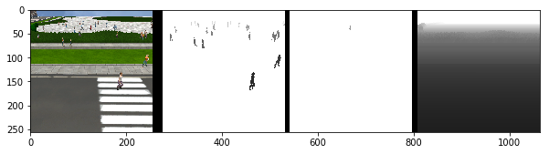
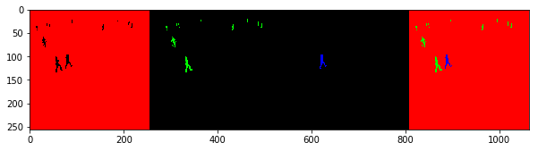
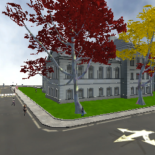
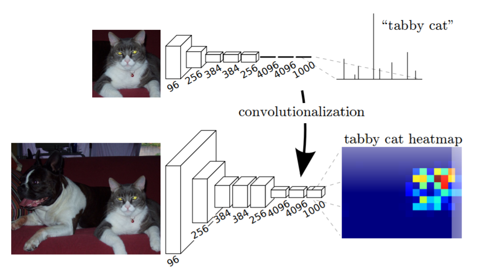
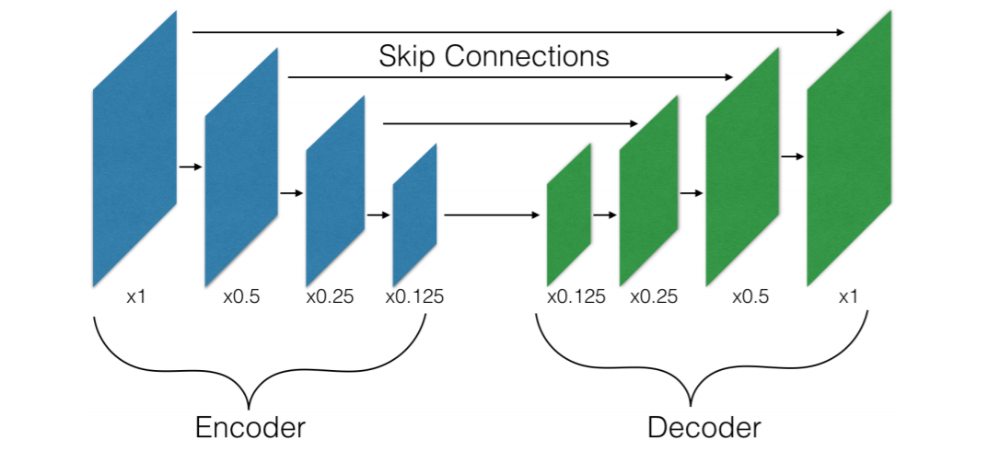
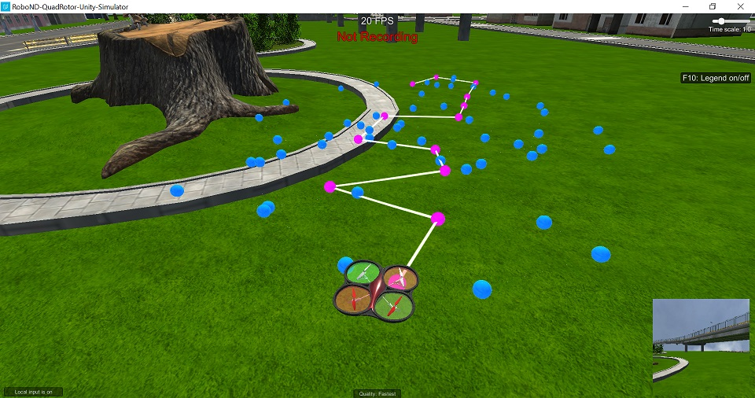
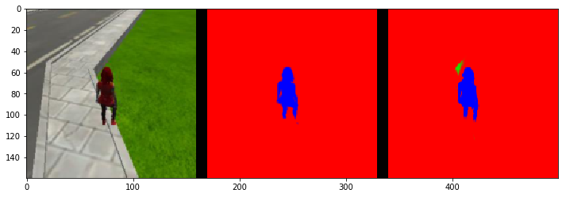
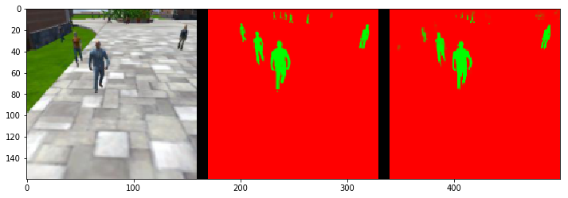
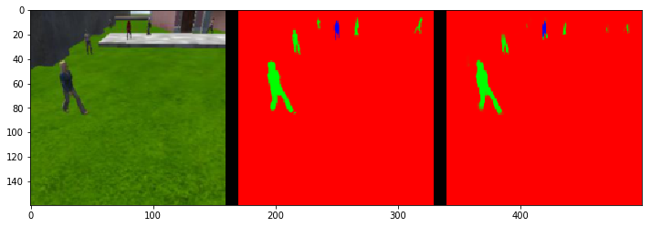

# Follow Me - Write Up

This work is part of the Udacity [Software Robotics NanoDegree](https://eu.udacity.com/) Term1

### INDEX

1. [Data Analysis](#DataAnalysis)
2. [Network Analysis](#NetAnalysis)
3. [HyperParameters and Iterations](#HP)
4. [Data Gathering](#DataGathering)
5. [Final Results](#FR)
6. [Further Developments](#FD)
7. [References](#ref)


- ####  Data Analysis <a id='DataAnalysis'></a>

After completing the segmentation lab one of the first things that I wondered about when carrying out this project was how to obtain the masks for training and validation data. After download and record the first run the answer was pretty obvious

The dron has 4 cameras with different views/ranges:
    1. World - all color image like a normal RGB camera
    2. People - filtered image for the people objects in the simulator
    3. Hero - filtered image for the hero object in the simulator
    4. Depth - depth camera for the world (do not see the people/objects)

The files after recording are labeled as follow for one of the four cameras  "cam( number )_( 5 digits number )"


<p style="text-align: center;">Fig. 1 </p>

With a simple script we can extract and visualize the different camera views and finally obtain a masked image. Hopefully Udacity provides a preprocess function that make this for us but I found very instructional doing it by myself. The figure 2 illustrate the masking process.


<p style="text-align: center;">Fig. 2 </p>

Additionally, as we saw in the lectures the input data for the neural network should be conditioned in order to help the convergence of the model as we train it. In the next section we take a random raw image (figure 3) from the drone camera and calculate the input after and before the preprocess_input function.



<p style="text-align: center;">Fig. 3 </p>

``` python
def preprocess_input(x):
    x = x/255.
    x = x-0.5
    x = x*2.
    return x

def image_stats(analysis_img):
    # compute stats for an image
    # input: np array containing the image
    # output: stats = [max,min,mean,standard deviation]
    stats = []
    stats.append(np.amax(analysis_img))
    stats.append(np.amin(analysis_img))
    stats.append( float("%.2f" % np.mean(analysis_img)))
    stats.append(float("{0:.2f}".format(np.std(analysis_img))))
    return stats


#The path for the image
filename = os.path.join('..','images','cam1_00002.png')
#read the image
analysis_img = misc.imread(filename)
after_processing_analysis_img = preprocess_input(analysis_img)
```

- original image  : [max,min,mean,std] =  [255, 0, 104.63, 67.64]

- processed image : [max,min,mean,std] =  [1.0, -1.0, -0.18, 0.53]

Now we have a well conditioned image input for a neural network (low standard deviation "0.53" and near zero mean "-0.18"), and as the multiplication and sum operator are bijective functions we have the same information but in a different spatial position.

##  Network Analysis <a id='NetAnalysis'></a>

In the Convolutional Neural Network Lab (CNN-Lab) we applied several convolutional layers to an image. This method allow the extraction of features from different places in the image, so our neural network could compare and detect images even if they are in different positions within the input image. The final objective of a CNN is to classify and image in a simple categories list, to make this possible the final layers of the CNN are a few fully connected and dropout layers that ended in a final classification output layer.

This dense layer method throw away all the spatial coordinates as the desired output is a non-spatial categorization. If we use a 1x1 convolution with a kernel that cover the entire input instead of a fully connected layer we can maintain the spatial information. The figure 4 illustrate this transformation of a CNN in a FCN for make spatial prediction maps [1].


<p style="text-align: center;">Fig. 4 </p>

The next important concept in making FCN is skip connections so we can recover information from deeper layers containing finest details, in my first attempt to build the FCN I attached only one decoder block to the final convolution obtaining a full set of red classified images. After more failed attempts without adding the weights for the final classification layer, I understood that I needed to sum up the layers decoding the information with the bilinear upsampling method.

``` python
def decoder_block(small_ip_layer, large_ip_layer, filters):

    # Upsample the small input layer using the bilinear_upsample() function.
    upsampled_layer = bilinear_upsample(small_ip_layer)
    # Concatenate the upsampled and large input layers using layers.concatenate
    concatenated_layers = layers.concatenate([upsampled_layer, large_ip_layer])
    # Add some number of separable convolution layers
    lay1 = separable_conv2d_batchnorm(concatenated_layers, filters, strides=1)
    output_layer = separable_conv2d_batchnorm(lay1, filters, strides=1)
    return output_layer
```

Studying a little bit more the upsampling and method I decided to go with a 4 layer encoder/decoder solution as shows the figure 5 [2]. The last layer that act as a classifier is a 2Dconvolution with 3 channels as we want to choose among 3 different categories for each pixel.


<p style="text-align: center;">Fig. 5 </p>

For the final model I used a simple encoder block with only one 2D separable convolution. In the layer there is also a batch normalization steps, the batch normalization tries to reduce the internal covariate shift in order to improve the training speed, achieve higher accuracy and use higher learning rates. Also, it can be seen as a substitute for dropout as acts as a regularizer.[3]

``` python
def encoder_block(input_layer, filters, strides):

    #  Create a separable convolution layer using the separable_conv2d_batchnorm() function.
    output_layer = separable_conv2d_batchnorm(input_layer, filters, strides)
    return output_layer

```

To build the network we use the skip connection structure presented in the figure 5, in the following code snippet the fcn_model_best function is presented. We attach the encoder to the corresponding decoder modules summing up the layers to obtain the output_layer. In each step we go deeper adding more channels to the Tensors.


``` python
def fcn_model_best(inputs, num_classes):

    # Adding  Encoder Blocks.
    encod1 = encoder_block(inputs, 32, 2)
    encod2 = encoder_block(encod1, 64, 2)
    encod3 = encoder_block(encod2, 128, 2)
    encod4 = encoder_block(encod3, 256, 2)

    # Add 1x1 Convolution layer using conv2d_batchnorm().
    conv_layer = conv2d_batchnorm(encod4, 256, kernel_size=1, strides=1)

    # Add the same number of Decoder Blocks as the number of Encoder Blocks
    decod1 = decoder_block(conv_layer, encod3, 256)
    decod2 = decoder_block(decod1, encod2, 128)
    decod3 = decoder_block(decod2, encod1, 64)
    decod4 = decoder_block(decod3, inputs, 32)

    # The function returns the output layer of your model. "x" is the final layer obtained from the last decoder_block()
    return layers.Conv2D(num_classes, 3, activation='softmax', padding='same')(decod4)

```


We could visualize the shape of the Tensors with the methods `get_shape()` and `as_list()`. As we see the final layer has the same shape as the input layer. If we choose to change the size of the input image, the output image would change as well.


Layer Size | shape
 --- | ---
**Input** | `[None, 160, 160, 3]`
encod1  |`[None, 80, 80, 32]`
encod2  |`[None, 40, 40, 64]`
encod3  | `[None, 20, 20, 128]`
encod4  | `[None, 10, 10, 256]`
conv_layer  | `[None, 10, 10, 256]`
decoder1   | `[None, 20, 20, 256]`
decoder2   | `[None, 40, 40, 128]`
decoder3   |` [None, 80, 80, 64]`
decoder4   | `[None, 160, 160, 32]`
**output**  | `[None, 160, 160, 3]`


## HyperParameters and Iterations <a id='HP'></a>

With all the theory at hand the next step was put all this to work, tuning the hyperparameters and the deep of our networks for getting the best results. I started with the final parameters from the segmentation lab and code the proposed values for the `steps_per_epoch` and `validaion_steps`. I added my own variables `encoder_type` and `test_name` to help me track all the tests that I did.

``` python
# HYPERPARAMS EXAMPLE

#stract stats from the training folder
n_valid_images = len(glob.glob(os.path.join('..', 'data', 'validation','images','*')))
n_train_images = len(glob.glob(os.path.join('..', 'data', 'train','images','*')))

#define Hyperparameters to load
encoder_type= 'FCN4_SIMPLE'
learning_rate = 0.0001
batch_size = 200
num_epochs = 40
steps_per_epoch = int(n_train_images/num_epochs)
validation_steps = int(n_valid_images/num_epochs)
workers = 4


```

I create some tools to help me run the tests in the AWS virtual instance without losing time. The step by step process would be as follow:

 - Select some hyperparemeters and load the cases to a pickle file with `create_test_cases.py`
 - launch the `trainer.py` inside the AWS to run the test cases all together.

 To visualize the test cases I use `view_test_cases.py`.

When you launch `trainer.py` it asks for the test_file.p that you want to use. Choose a number and go with this one. After this `trainer.py` ask for keep or discard the previous weights. If 'yes' is selected we can continue training the model and change whatever hyperparameter we may need to change.

An example of a test_cases is:
``` python
{'workers': 2, 'steps_per_epoch': 206, 'encoder_type': 'FCN4_0', 'name': 'FCN4_0_lr0001_bs50_ne20_se206_vs59_wr2', 'validation_steps': 59, 'batch_size': 50, 'num_epochs': 20, 'learning_rate': 0.0001}
{'steps_per_epoch': 206, 'workers': 2, 'encoder_type': 'FCN4_1', 'name': 'FCN4_1_lr0001_bs50_ne20_se206_vs59_wr2', 'batch_size': 50, 'num_epochs': 20, 'learning_rate': 0.0001, 'validation_steps': 59}
 ```

 In this case we train the model in two equal steps of 20 epoch each. The testing tools can be found in [../utils/testing_tools.py]


After the four encod/decod blocks FCN with 1 layer encoder, I tried to going deeper with a double layer encoder and 5 blocks, but the results that I was obtaining after several different learning rates and batch sizes (28% / 30% ) were lower than with the 4  simple encoder model model (34%).

I spent several days twitching and testing different parameters, lower learning rates with more epochs or different batches sizes. But the highest rank that I achieve was the 34%. The next step was go the simulator and gather more data.

## Data Gathering <a id='DataGathering'></a>

Following the instruction from the project gather more data was very easy once you understand the file structure.

I focused on the hero from far away as the result for previous training showed that is where the model was failing. After 3 different runs in different parts of "Udacity" I added 872 new images and mask (obtained with `preprocess_ims.py`).


An example of the sets that I used is shown in the figure 6


<p style="text-align: center;">Fig. 6 </p>

The final data set for training contained:

- num_train_images = 5003
- num_validation_images = 1184


## Final Results <a id='FR'></a>

The evaluation of the model is an easy task provided by Udacity.

The name for my final model is `FCN4_SIMPLE_lr001_bs50_ne20_se250_vs59_wr4`, The hyperparameters can be extracted  from the name convention and are the following:

- encoder_type= 'FCN4_SIMPLE'
- learning_rate = 0.001
- batch_size = 50
- num_epochs = 20
- steps_per_epoch = 250
- validation_steps = 59
- workers = 4

FCN4_SIMPLE is the name for the `fcn_model_best` contained in `aux_functions.py` as pointed before it has 4 encoders with increasing depths of [32,64,128,256], a 1x1 convolution of 256 channels, 4 decoder steps of decreasing depth [256,128,64,32] and a final 2Dconv layer with 3 channels for the output.

The next 3 figures are shown the predictions of the model in the different scenarios:

#### While following the target

<p style="text-align: center;">Fig. 7 </p>

    number true positives: 539, number false positives: 0, number false negatives: 0

#### While at patrol without target

<p style="text-align: center;">Fig. 8 </p>

    number true positives: 0, number false positives: 39, number false negatives: 0

#### While at patrol with target

<p style="text-align: center;">Fig. 9 </p>

    number true positives: 121, number false positives: 1, number false negatives: 180


And The final score achieved is:


<p style="text-align: center;">**Final Score = 0.419185063628**  </p>

This results can be reproduce using the file named `FCN4_SIMPLE_lr001_bs50_ne20_se250_vs59_wr4` that can be found in the "weights" folder of this repository.


## Further Developments <a id='FD'></a>

At the results reflects, apart from twitch the hyperparameters a little bit more. One possible solution would be collect more data of the different people that the simulator spaws. There are a few falses positives in the 'patrol without hero' section, sometimes the model confuse corners with the hero and other times with random people as the section 'patrol with target' told us. Focus on people + hero from far away and look all over the world without people to get images of almost all the objects of the simulator.

One improvement that I would like to implement is the detection of different objects, heros, buildings, etc. To allow this, we would need to create masks with this objects in them for training, and change the final layer of the neural network to add this new categories. It came to my mind that in real life one of the main difficulties on training neural networks is get the masks for training.

I really enjoyed the process of understand, deploy and train Neural Networks. I would like to train this model again but this time using the depth camera as mask and compare the results. It is very interesting think about train with the mask from a depth camera and then try to get the similar results with a neural network and avoid collisions with tihs processes images. Of course, we should calculate how much we save from get rid of the depth camera and added the extra calculation steps to the CPU. But, In aeronautical applications like drones the weight saving could be worth it.

### References <a id='ref'></a>

[1]: Jonathan Long, Evan Shelhamer, and Trevor Darrell. Fully convolutional networks for
semantic segmentation. In Proceedings of the IEEE Conference on Computer Vision
and Pattern Recognition, pages 3431–3440, 2015.

[2]: Panqu Wang, Pengfei Chen, Ye Yuan, Ding Liu, Zehua Huang, Xiaodi Hou and Garrison Cottrell. Understanding Convolution for Semantic Segmentation. 	arXiv:1702.08502, 27 Feb 2017.

[3]: Sergey Ioffe and Christian Szegedy. Batch Normalization: Accelerating Deep Network Training by Reducing Internal Covariate Shift. arXiv:1502.03167, 2 Mar 2015.
